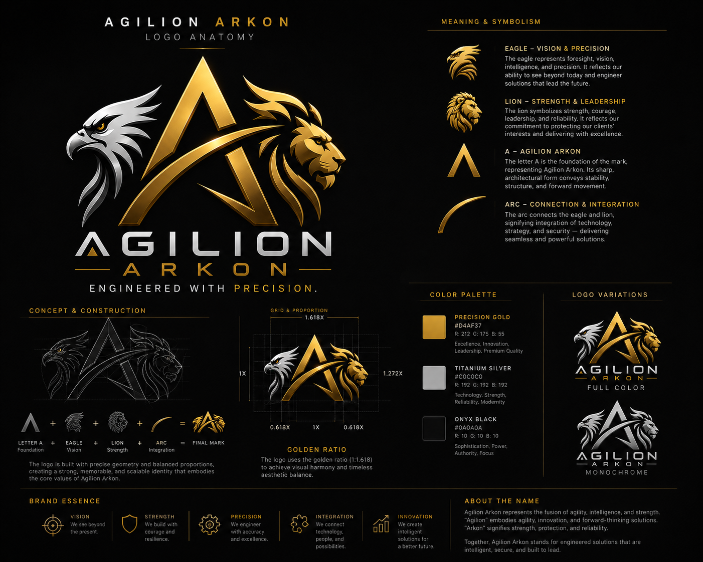

# John Wilberth B. Botin

**IT Support · Cybersecurity · Full-Stack Development · Digital Content**

BSIT (Network & Cybersecurity) student in the Philippines building secure, practical digital products.

[**Portfolio**](https://johnwilberthbotin.vercel.app/) · [LinkedIn](https://www.linkedin.com/in/johnwilberthbotin) · [Email](mailto:contactjohnbotin@gmail.com)

## About me

I work across IT support, web and business-system development, technical SEO, automation, and digital content. I enjoy taking projects from requirements to launch—building responsive interfaces, integrations, deployment workflows, and handoffs that people can actually use.

I am currently a freelance web and systems developer, the founder of **Agilion**, and a Bachelor of Science in Information Technology student at Mapúa Malayan Digital College specializing in Network & Cybersecurity.

## What I work with

  

| Area | Technologies |
| --- | --- |
| Languages | TypeScript, JavaScript, Python, Java, C, C++, HTML, CSS |
| Web & backend | Next.js, React, Tailwind CSS, NestJS, Prisma |
| Data & platforms | PostgreSQL, GitHub, Vercel, Railway, Cloudflare R2 |
| Delivery & security | API integrations, JWT sessions, reCAPTCHA, technical SEO, analytics, accessibility |
| Media & content | Sharp, FFmpeg, Meta Business Suite, Canva |

## Selected work

- **Bayleaf Builders and Realty Corporation** — a responsive full-stack real estate platform with secure tools for listings, inquiries, media, and business content.
- **Villa Ikarus** — a production-ready resort website with inquiry flows, PHP/USD pricing, AI-assisted guest questions, and technical SEO.
- **[Tigil Kalat PH](https://github.com/itspodleeeee/Tigil_Kalat_PH)** — an accessible educational website promoting environmental awareness.
- **Xavier Filipino Version** — a viral digital-content project later featured on GMA's *I Juander*.

Some client work is not listed publicly because it is covered by confidentiality agreements. More details are available in my [project portfolio](https://johnwilberthbotin.vercel.app/#projects).

## Agilion

  

I founded **Agilion** to build scalable, efficient digital solutions across software and web development, business automation, and IT services—with an emphasis on reliability, precision, and long-term value.

## Experience & recognition

- **Freelance Web & Systems Developer** — 2025–Present
- **Content Creator & Social Media Manager** — 2022–Present
- **MMDC Exemplary Learner Output (ELO) Nominee**
- **Featured on GMA's *I Juander***
- **[Microsoft Office Specialist: Word Associate](https://www.credly.com/badges/e740844a-a342-47e0-8a47-74db220cd37e/public_url)**

## Let's connect

I am open to entry-level IT support, technical operations, network and cybersecurity internships, and digital content opportunities.

**[contactjohnbotin@gmail.com](mailto:contactjohnbotin@gmail.com)**
